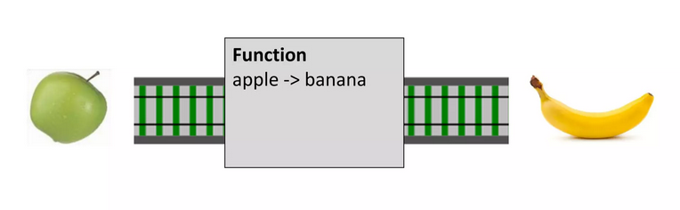
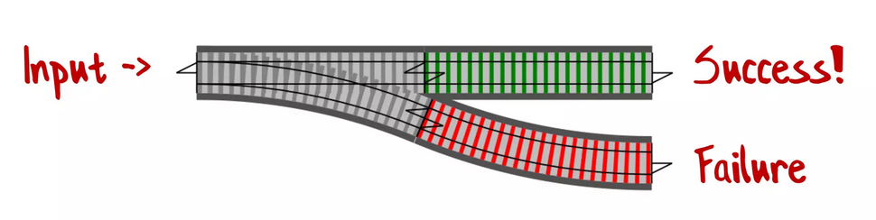
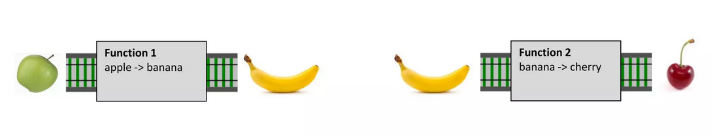
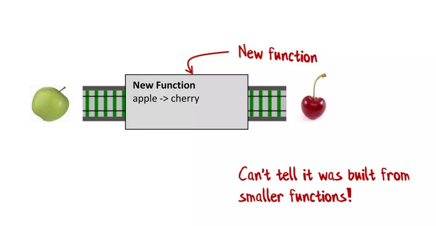
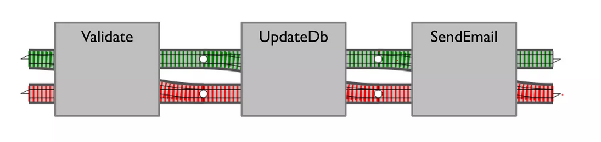
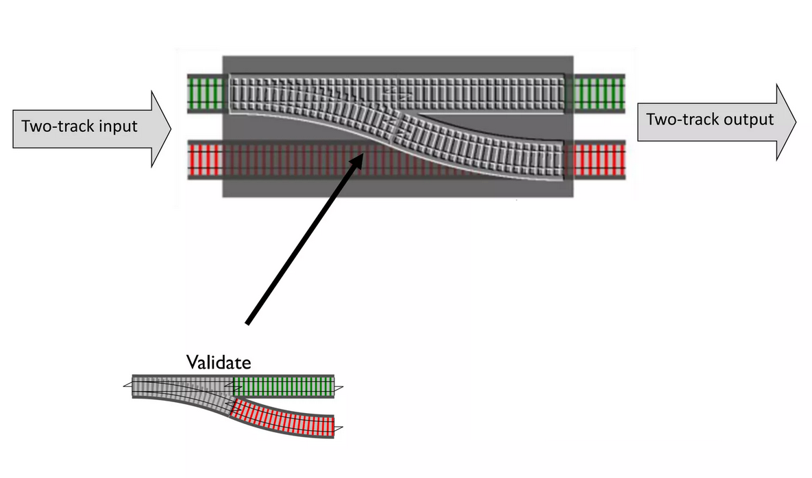
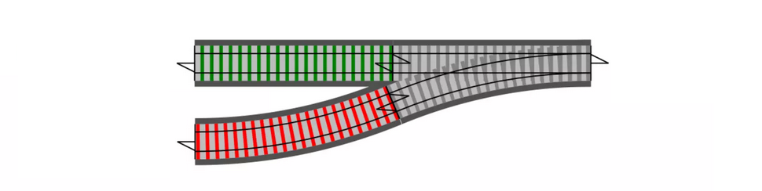

# AFPY

x

# Lowit

Samuel DE FRAMOND

samuel.deframond@lowit.fr

---

1. Correct
2. Maintenable

---

>
> Explicit is better than implicit.

---

> Errors should never pass silently.
>
> Unless explicitly silenced.

---

```python
def calculer_imc(taille, poids):
    return poids / (taille * taille)
```

---

```python
>>> calculer_imc(1.93, 74) # OK
19.86630513570834
>>> calculer_imc(0, 74)
Traceback (most recent call last):
  File "<stdin>", line 1, in <module>
  File "<stdin>", line 2, in calculer_imc
ZeroDivisionError: division by zero
```

---

```python
def traiter_requete_http(requete):
    id = int(requete.payload.id)
    imc = calculer_imc_dun_utilisateur(id)
    return {"Result" : imc}, 200

def calculer_imc_dun_utilisateur(id_utilisateur):
    utilisateur = db.trouver_un_utilisateur_par_id(id_utilisateur)
    return calculer_imc_dune_personne(utilisateur)

def calculer_imc_dune_personne(personne):
    return calculer_imc(personne.taille, personne.poids)

def calculer_imc(taille, poids):
    return poids / (taille * taille)
```

---

```text
__main__
    -> traiter_requete_http(...)
        -> calculer_imc_dun_utilisateur(3)
            -> calculer_imc_dune_personne(<...personne...>)
                -> calculer_imc(0, 74)
                    -> # Boum !
```

---

## Facile !

```python
def traiter_requete_http(requete):
    id = int(requete.payload.id)
    try:
        imc = calculer_imc_dun_utilisateur(id)
    except ZeroDivsionError as e:
        log("Une erreur s'est produite")
        return {"Result" : "Error"}, 500
    return {"Result" : imc}, 200
```

---

## Facile !

```python
def traiter_requete_http(requete):
    id = int(requete.payload.id)
    try:
        imc = calculer_imc_dun_utilisateur(id)
    except ZeroDivsionError as e:
        log("Une erreur s'est produite")
        return {"Result" : "Error"}, 500
    return {"Result" : imc}, 200
```

Confession

---

```python
def un_bout_de_code_au_plus_profond_des_entrailles(args):
    if args.schroumpf is None:
        raise ErreurPasDeSchtroumpf("Sauve qui peut !!!")
    
    return args.toto / args.schroumpf
```

---

```python
from flask import Flask, request
import json

app = Flask(__name__)

@app.route('/json-example', methods=['POST'])
def json_example():
    data = request.get_json() # Ca peut exploser !
    result = save_foo_bar_baz(data) # Ca peut exploser !
    return json.dumps(result) # Ca peut exploser ?
```

---


---

## Peut-on faire mieux ?

---

## La programmation tchou-tchou

(Railway Oriented Programming)

---



---

```python
def inverse(x):
    return 1/x
```

---



---

```python
def inverse(x):
    if x != 0:
        return 1/x
    else:
        return "Erreur"
```

---

```python
@dataclass
class Ok:
    value: Any
```

```python
@dataclass
class Error:
    error: Any
```

```python
def inverse(x):
    if x == 0:
        return Error("Erreur")
    else:
        return Ok(1/x)
```

---



---



---

```python
def inverse(x):
    return 1/x

def ajouter_deux(x):
    return x + 2

def toto(x):
    """Retourne 2 + 1/x"""

    return ajouter_deux(inverse(x))
```

---


---


---



---

```python
def inverse(x_ou_erreur):
    match x_ou_erreur:
        case Ok(x)
            if x == 0:
                return Error("Erreur")
            else:
                return Ok(1/x)
        case Error(erreur):
            return Error(erreur)
```

```python
def ajouter_deux(x_ou_erreur):
    match x_ou_erreur:
        case Ok(x)
            return Ok(x + 2)
        case Error(erreur):
            return Error(erreur)
```

```python
def toto(x):
    """Retourne 2 + 1/x ou une erreur."""

    return ajouter_deux(inverse(x))
```

---



---

```python
def inverse(x):
    if x == 0:
        return Error("Erreur")
    else:
        return Ok(1/x)
```

```python
def ajouter_deux(x):
    return Ok(x + 2)
```

```python
def toto(x):
    """Retourne 2 + 1/x ou une erreur."""
    match inverse(x)
        case Ok(x)
            return ajouter_deux(x)
        case Error(erreur):
            return Error(erreur)
```

---

```python
def inverse(x):
    if x == 0:
        return Error("Erreur")
    else:
        return Ok(1/x)
```

```python
def ajouter_deux(x):
    return Ok(x + 2)
```

```python
def toto(x):
    """Retourne 2 + 1/x ou une erreur."""
    match inverse(x)
        case Ok(x)
            return ajouter_deux(x)
        case Error(erreur):
            return Error(erreur)
```

Comment chainer une autre fonction ?

---


---

```python
@dataclass
class Ok:
    value: Any

    def then(self, f):
        return f(self.value)

@dataclass
class Error:
    error: Any

    def then(self, f):
        return self
```

---

```python
def inverse(x):
    if x == 0:
        return Error("Erreur")
    else:
        return Ok(1/x)
```

```python
def ajouter_deux(x):
    return Ok(x + 2)
```

```python
def toto(x):
    """Retourne 2 + 1/x ou une erreur."""

    return inverse(x).then(ajouter_deux)
```

---

```python
def inverse(x):
    if x == 0:
        return Error("Erreur")
    else:
        return Ok(1/x)
```

```python
def ajouter_deux(x):
    return Ok(x + 2)
```

```python
def toto(x):
    """Retourne 2 + 1/x ou une erreur."""

    return inverse(x).then(ajouter_deux)
```

## Et en vrai ?

---

```python
@app.route('/json-example', methods=['POST'])
def json_example():
    return (
        request
        .get_json()
        .then(save_foo_bar_baz)
        .then(json.dump)
        .process_error(error_response) # On a pas vu ça
    )
```

```python
def error_response(error):
    match error:
        case ParsingError(message):
            return {"Result" : "ParsingError: {message}"}, 422
        case BusinessError(message):
            return {"Result" : "BusinessError: {message}"}, 406
```

---

process_error(self, f):



---

```python
@dataclass
class Ok:
    value: Any

    def then(self, f):
        return f(self.value)

    def process_error(self, f):
        return self.value
```

```python
@dataclass
class Error:
    error: Any

    def then(self, f):
        return self
        
    def process_error(self, f):
        return f(self.error)
```

---

## Avantages

- Contrôle fin du flux d'arreur
- Pense-bête
- Encourage le code modulaire
- Code correct & maintenable :)

---

## Inconvénients

- Pas du tout idiomatique en Python
- Demande de prendre l'habitude
- On a fait très bien sans ça jusqu'ici

---

## Pour récapituler

POO + programmation fonctionnelle FTW !

- Augmenter la fiabilité ?
- ...en conservant la lisibilité ?

---

## Pour récapituler

POO + programmation fonctionnelle FTW !

- Augmenter la fiabilité ?
- ...en conservant la lisibilité ?

=> On peut en discuter avec une boisson !

---

## Pour aller plus loin

- On peut ajouter d'autre fonctions pratiques:
  - `map`
  - `map_error`
  - `safe`
- Combiner avec Mypy ?
- On peut apliquer le motif de fonctions "chainables" à d'autre choses:
  - Programmation asynchrone / parallèle / concurrente
  - Valeurs _None_-able
  - ...

---

https://www.slideshare.net/ScottWlaschin/railway-oriented-programming

---

## Merci !

Questions ?

---

```python
@app.route('/json-example', methods=['POST'])
def json_example():
    return (
        safe(request.get_json)()
        .then(save_foo_bar_baz)
        .map(json.dump)
        .process_error(error_response)
    )
```
